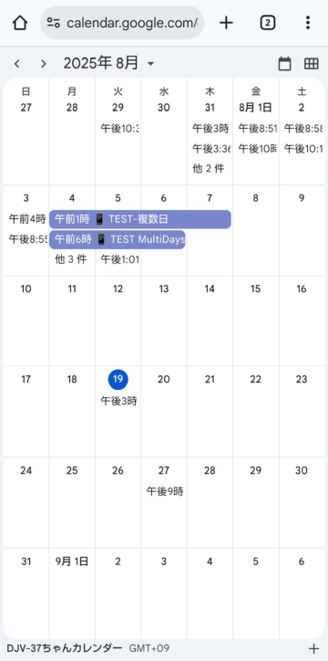

# こよみがかり ユーザーガイド

**バージョン**: 1.0
**最終更新**: 2025年9月9日  

## 📋 目次

1. [こよみがかり について](#こよみがかりについて)
2. [基本的な使い方](#基本的な使い方)
3. [予定の登録方法](#予定の登録方法)
4. [予定の修正・削除](#予定の修正削除)
5. [リマインド機能](#リマインド機能)
6. [@everyone通知](#everyone通知)
7. [便利な機能](#便利な機能)
8. [よくある質問](#よくある質問)

---

## こよみがかり について

「こよみがかり」は Discordコミュニティの予定をGoogleカレンダーと連携して共有・管理できるBOTシステムです。

### ✨ 主な機能

- **予定の登録・修正・削除**: 簡単な操作でカレンダーに予定を追加
- **自動リマインド**: 当日の朝と開始直前に通知
- **@everyone通知**: 重要な予定の事前告知
- **今日の予定表示**: ワンクリックで当日の予定を確認

---

## 基本的な使い方

### 🎯 カレンダー管理パネルの使用

Discordのチャンネル内に設置した「カレンダー管理」パネルのボタンを使って操作します：

| ボタン | 機能 |
|--------|------|
| ➕ **予定を登録** | 新しい予定を追加 |
| ✏️ **予定を修正** | 既存の予定を変更 |
| 🗑️ **予定を削除** | 不要な予定を削除 |
| 📆 **今日の予定** | 当日の予定一覧を表示 |
| **カレンダーを開く** | Googleカレンダーを直接表示 |

---

## 予定の登録方法

### 📝 登録手順

1. **「➕ 予定を登録」ボタンをクリック**
2. **入力フォームに必要事項を記入**
3. **「送信」で完了**

### 📋 入力項目の説明

#### **タイトル**（必須）
- 予定の名前を入力
- 例：「オフ会開催のお知らせ」、「ボイスチャット開催します」

#### **開始日時**（必須）
- 予定の開始時刻を入力
- **入力例**：
  - `2025/01/15 14:30` （完全指定）
  - `01/15 14:30` （今年の1月15日）
  - `14:30` （今日の14時30分）

#### **終了日時**（必須）
- 予定の終了時刻を入力
- 開始日時と同じ形式で入力

#### **開催方式**（必須）
- 数字で開催形式を指定します。（Googleカレンダー上でアイコンが自動で付きます）
  - `1` = **オンライン**（Zoom/ボイチャなど） 📱
  - `2` = **オフライン**（リアル） 👥
  - `3` = **その他** 📝

#### **説明**（任意）
- 予定の詳細説明
- 場所、確認事項などを記入

#### 💡 @everyone通知
説明欄の**最初に**`@everyone`と入力すると、3日前と当日の朝5:00にDiscordに`@everyone`で通知されます。

---

## 予定の修正・削除

### ✏️ 予定の修正

1. **「✏️ 予定を修正」ボタンをクリック**
2. **修正したい予定を選択**
   - リストから選択、または
   - イベントIDで直接指定
3. **修正フォームで内容を変更**
4. **「送信」で完了**

### 🗑️ 予定の削除

1. **「🗑️ 予定を削除」ボタンをクリック**
2. **削除したい予定を選択**
3. **確認画面で「この予定を削除する」をクリック**

### 🔐 重要な注意

- リストで選択できるのは、**今後14日間（現在開催中を含む）の自分が登録した予定**
- **自分が登録した予定のみ修正・削除可能**（サーバー管理者は除く）
- 他の人の予定は修正・削除できません

### 🆔 イベントIDでの指定

予定にはそれぞれ固有の「イベントID」が割り当てられます：
- 例：`EVTLO9K2ABC1`
- 直接イベントIDを入力して予定を指定することも可能
- **日付ヒント付きでの指定**: `2025-01-15:EVTLO9K2ABC1`
  - 日付形式は `2025/01/15` や `20250115` も利用できます。
- イベントIDだけで指定できるのは**前後1年間の予定**です。それを超える場合は日付ヒント付きで指定してください。

---

## リマインド機能

### 📅 日次リマインド

**毎朝5:00**に、その日の予定一覧がDiscordに自動送信されます（予定がある場合のみ）。

**表示内容**：
- 今日開催される全ての予定
- 開始・終了時刻
- 登録者名
- 開催方式

### ⏰ 開始直前リマインド

**1時間以内に開始される予定**がDiscordにリマインド送信されます。

---

## @everyone通知

### 📢 事前通知システム

重要な予定について、Discordコミュニティ全員に事前通知を送ることができます。

### 🎯 使用方法

予定の登録・修正時の説明欄の**最初に**`@everyone`と入力する。

### 📬 通知タイミング

1. **3日前の朝5:00** - 事前通知
2. **当日の朝5:00** - 当日通知

### ⚠️ 注意点

- `@everyone`は説明文の**最初**に記載してください。
- 通知は`@everyone`メンション付きでDiscordに送信されます。

---

## 便利な機能

### 📆 今日の予定確認

**「📆 今日の予定」ボタン**で当日の予定を即座に確認できます。

**表示内容**：
- 今日開催される全予定
- 時刻順でソート
- 登録者情報も表示

### 🎨 開催方式による色分け（PCのみ）

Googleカレンダー上で予定が色分けされます：
- 🔵 **青色** - オンライン開催
- 🔴 **赤色** - オフライン開催  
- 🟡 **黄色** - その他

### 📱 アイコン表示

Googleカレンダー上で予定のタイトルに開催方式に応じたアイコンが自動追加されます：
- 📱 オンライン
- 👥 オフライン
- 📝 その他

---

## よくある質問

### ❓ 予定が登録できません

**確認事項**：
- **サーバーへの参加日数**: サーバーによっては、参加してから一定期間が経過しないと予定を登録できない場合があります。必要な日数についてはサーバー管理者にご確認ください。
- **日時の形式**: 日時の形式は正しいですか？ (`例: 2025/01/15 14:30`)
- **日時の順序**: 開始時刻より終了時刻が後になっていますか？
- **開催方式**: 開催方式は`1`、`2`、`3`のいずれかですか？

### ❓ 修正・削除ボタンを押しても予定が表示されません

**原因**：
- 現在開催中、または今後14日間に自分が登録した予定がないためです。

**対処法**：
- カレンダー管理パネルの「カレンダーを開く」で直接Googleカレンダーを確認し、予定のイベントIDや登録者（自分かどうか）を確認してください。
- イベントIDで直接指定することで、期間外の予定も操作できます。
- 前後1年を超える予定は、日付ヒント付きのイベントIDで指定してください。

### ❓ リマインドが来ません

**確認事項**：
- サーバー管理者がリマインド通知用のチャンネルを正しく設定しているかご確認ください。

### ❓ @everyone通知が送られません

**確認事項**：
- 説明欄の**一番最初**に`@everyone`を記載していますか？
- サーバー管理者が`@everyone`通知用のチャンネルを正しく設定しているかご確認ください。

### ❓ エラーメッセージが表示されました

**表示される詳細な修正案を参考にしてください**：
- システムが入力内容を分析し、問題点と修正案を提示します。
- 「修正して再入力」ボタンを押すと、元の入力内容が引き継がれたフォームで修正を再試行できます。

---

## 📝 更新履歴

- **v1.0** (2025年9月9日): 初回リリース

---

**© 2025 こよみがかり**